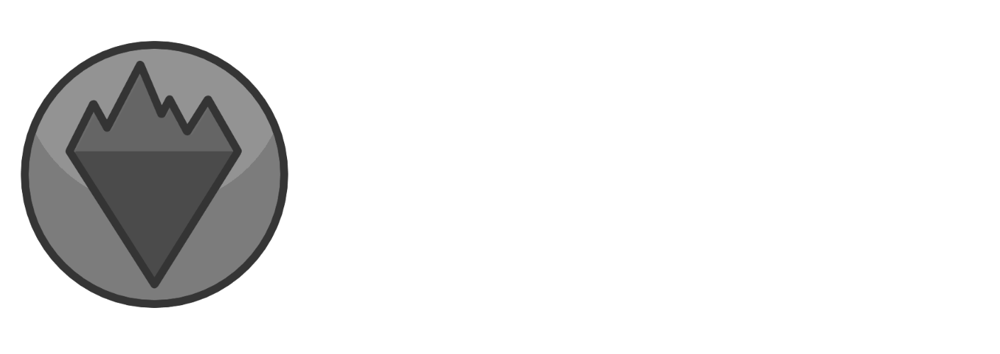

Astro Engine is a game development framework that provides all the things you need to
easily develop games. In no small part, Astro Engine provides bindings for the libraries
[Vulkan2D](https://github.com/PaoloMazzon/Vulkan2D) and [JamUtil](https://github.com/PaoloMazzon/JamUtil)
to a [Wren](https://github.com/wren-lang/wren) virtual machine, with various additional features
provided in the bindings. It will also provide a slew of other features to make development
faster and easier.

Getting Started
===============
To use the Astro Engine runtime you must first compile it from source. That won't be covered
here in detail at the moment, but in brief, clone this repository and all the submodules
and run the CMake file. From there, feel free to just use the basic demo that is in this repo.

A basic game
------------

    import "lib/Levels" for Level
    import "lib/Renderer" for Renderer
    import "lib/Sprite" for Sprite
    import "lib/Engine" for Engine
    import "lib/Input" for Input
    import "lib/BitmapFont" for BitmapFont
    
    class Game is Level {
        construct new() { }
        
        create() {
            Engine.cap_fps(60)
            _font = BitmapFont.new("assets/font.png", 32, 128, 40, 70)
            _spr = Sprite.new("assets/sprite.png", 0, 0, 16, 16, 0.3, 4)
            _x = 100
            _y = 100
        }
    
        update() {
            var speed = Engine.delta() * 100
            if (Input.keyboard_get_key(Input.KEY_A)) {
                _x = _x - speed
            }
            if (Input.keyboard_get_key(Input.KEY_D)) {
                _x = _x + speed
            }
            if (Input.keyboard_get_key(Input.KEY_W)) {
                _y = _y - speed
            }
            if (Input.keyboard_get_key(Input.KEY_S)) {
                _y = _y + speed
            }
    
            Renderer.draw_sprite(_spr, _x, _y)
            Renderer.draw_font(_font, "My Game", 0, 0)
        }
    
        destroy() { }
    }
    
And the corresponding `init.wren` file

    import "lib/Renderer" for Renderer
    import "Game" for Game
    
    var renderer_config = {
        "window_title": "Game",
        "window_width": 800,
        "window_height": 600,
        "msaa": Renderer.MSAA_8X,
        "screen_mode": Renderer.SCREEN_MODE_TRIPLE_BUFFER,
        "filter_type": Renderer.FILTER_TYPE_NEAREST
    }
    
    var start_level = Game.new()

Here are the specifications for using the runtime

 + The runtime entry point is `prog/init.wren`, from there where you put your source files
 is irrelevant to the runtime as long as you import them all properly
 + Wren bindings must be located in `prog/lib/`
 + The runtime treats `prog/` as the import working directory
 + `prog/init.wren` must contain at least two top-level variables `start_level` and `renderer_config`
 that will be detailed below

`prog/init.wren` Variables
--------------------------
`start_level` must be a new instance of a class that implements all methods of `Level`. The runtime
will use that class to start the game from.

`renderer_config` must be a map of details on how to initialize the renderer. All of the following
keys must be provided:

 + `window_title` - A string which will be the window's title
 + `window_width` - Window width in pixels
 + `window_height` - Window height in pixels
 + `msaa` - Use `Renderer.MSAA_*` to select your preferred MSAA (if the selected MSAA isn't available
 the next highest available MSAA will be used instead)
 + `screen_mode` - Use `Renderer.SCREEN_MODE_*` to select your preferred screen mode (if that screen
 mode is unavailable `Renderer.SCREEN_MODE_IMMEDIATE` will be used instead)
 + `filter_type` - Use `Renderer.FILTER_TYPE_*` to select your preferred texture filter option

Features
========
Astro is still quite bare-bones at the moment while everything is still being ported over.
Technically, you can use it to make games right now but the biggest issue is the lack of an
audio subsystem as well as lack of any sort of file I/O. See the TODO section for an overview
on what is yet to come.

 + Easy-to-use API and simple language: [Wren](https://github.com/wren-lang/wren)
 + Load and draw textures, sprites, bitmap fonts, and surfaces
 + Fast and flexible cameras
 + Incredibly simple level management

TODO
====

Meta/Framework Things
---------------------

 + Debug mode that checks types on binded functions
 + Basic file I/O functions that can be binded to Wren since Wren doesn't provide any
 + Better audio system that can be binded to the VM
 + Asset loader should support sprites likely in the same way `GenAssets.py` does, also bitmap fonts
 + Entity management system through a spatial hash-map and collisions that utilize it
 + Detailed documentation for the Wren API

Bindings
--------

 + JamUtil `JUClock`, `JUFont` (non-bitmap), `JUSave`, collision/math things
 + 3D audio system
 + Generic file I/O
 + Foreign class for VK2D objects `VK2DModel`, `VK2DShader`, `VK2DPolygon` (not a priority)
 + Bind functions to the above foreign classes