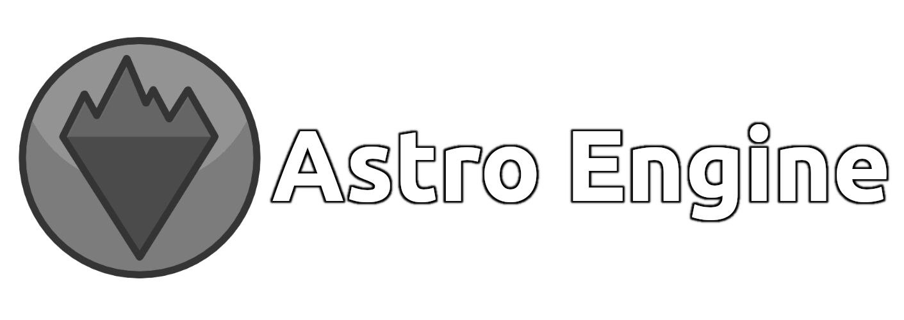
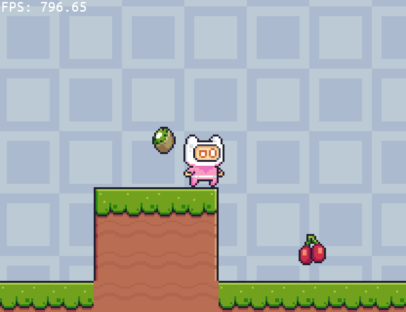

Astro Engine is a game development framework that provides all the things you need to
easily develop games. It uses the scripting language [Wren](https://github.com/wren-lang/wren)
for game logic, taking full advantage of the features that come with an embedded
scripting language.

Getting Started
===============
See [Getting Started](docs/GettingStarted.md) for a detailed breakdown, and check out the
[API Reference](docs/API.md) for everything else. In short, you need a Wren file the engine
will use as an entry point and at least one level.

A basic game
------------
    
    class Game is Level {
        construct new() { }
        
        create() {
            _x = 100
            _y = 100
        }
        
        pre_frame() { }
    
        update() {
            var speed = Engine.delta * 100
            if (Keyboard.key(Keyboard.KEY_A)) {
                _x = _x - speed
            }
            if (Keyboard.key(Keyboard.KEY_D)) {
                _x = _x + speed
            }
            if (Keyboard.key(Keyboard.KEY_W)) {
                _y = _y - speed
            }
            if (Keyboard.key(Keyboard.KEY_S)) {
                _y = _y + speed
            }
    
            Renderer.draw_sprite(Assets.spr_sprite, _x, _y)
            Renderer.draw_font(Assets.fnt_font, "The quick brown fox jumps over the lazy dog.", 0, 0)
        }
    
        destroy() { }
    }

See [Getting Started](docs/GettingStarted.md) for more information.

Features
========

 + Intuitive API that utilizes [Wren](https://github.com/wren-lang/wren) as its language
 + Manual and automatic resource management
 + Fast and very flexible cameras
 + Simple level and entity management
 + Complete [API documentation](docs/API.md)
 + Load [Tiled](https://www.mapeditor.org/) maps automatically

TODO
====

 + Networking support
 + Built-in mod support
 + Spatial hash maps
 + More example projects