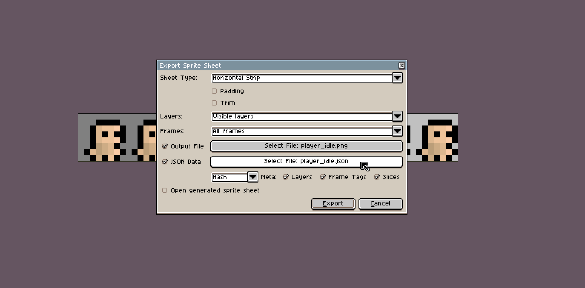

# Asset Compiler

 1. [Intro](#intro)
 2. [Recognized File Types](#recognized-file-types)
 3. [Loading Complex Assets](#loading-complex-assets)
 4. [Aseprite Sprite Loading](#aseprite-sprite-loading)
 5. [Excluding Files and Directories](#excluding-files-and-directories)

## Intro
Astro automatically creates a Wren module when it starts called `Assets` with one class:
`Assets`. In this class you will find all of the resources your game needs from the folder
`assets/` already loaded. Each loaded asset is accessible via their path relative to `assets/`,
but with their extension removed and a small prefix depending on what they were loaded as.
For example, `assets/player.png` would be accessed via `Assets.tex_player`, and 
`assets/sounds/music.wav` would be `Assets.sounds.aud_music`.

For example, if your `assets/` folder looks like

    | player.png
    | grass.jpg
    | music.wav

You would be able to access the files with

```javascript
Renderer.draw_texture(Assets.tex_player, 0, 0)
Renderer.draw_texture(Assets.tex_grass, 100, 100)
Audio.play(Assets.aud_music, true, 1, 1)
```
    
The `Assets` class is automatically imported in every file.

Based on the extension, the asset compiler will automatically load it as the proper class.
The `Assets` class also provides a way to access assets via a string name of the asset by the
`Assets[]` operator. With the `Assets[]` operator you may put in a path to your loaded file
relative to `assets/` once again. So `Assets.tex_player` is the same as `Assets["player.png"]`.

Prefixes

 + Sprites - `spr_*`
 + Textures - `tex_*`
 + Audio - `aud_*`
 + Bitmap fonts - `fnt_*`
 + TrueType fonts - `fnt_*`
 + Buffers - `buf_*`
 + Strings - `txt_*`
 
The asset compiler is recursive for sub-directories and all sub-directories are accessible
from the `Assets` class by replacing any `/`'s in the name with `.`'s instead. For example,
given the following as the structure of the `assets/` folder:

    | dir/
    |    | sprites/
    |    |        | player.png
    |    |        | player_run.png
    |    | jump.ogg
    | banner.jpg

You could access all of them in order through

```c
Assets.dir.sprites.tex_player
Assets.dir.sprites.tex_player_run
Assets.dir.aud_jump
Assets.tex_banner
```

Additionally, check out the [demos on Github](https://github.com/PaoloMazzon/Astro/tree/master/examples)
to see how this is used.

## Recognized File Types
In brief,

 + `.png`, `.bmp`, `.jpg`, and `.jpeg` are all recognized as textures.
 + `.wav` and `.ogg` are audio.
 + `.txt` is a string.

To load sprites, bitmap fonts, truetype fonts, buffers, or non-.txt strings automatically
you have to make the asset compiler aware of them through a `assets.json` file. It is outlined
in more detail [here](#loading-complex-assets). Sprites may also be loaded through a corresponding
*texture-file*.json file in the same directory as *texture-file*.

## Loading Complex Assets
Using an `assets.json` file in any folder in the `assets/` folder you may specify sprites/fonts/buffers/strings
inside that folder (sub-directories of `assets/` need their own `assets.json` file too).
Inside each `assets.json` there are several recognized top-level objects:

 + `"sprites"` - A json array of json objects containing information on each sprite.
 + `"fonts"` - A json array of json objects containing information on each true type font.
 + `"bitmap_fonts"` - A json array of json objects containing information on each bitmap font.
 + `"buffers"` - A json array of json objects containing information on each buffer.
 + `"strings"` - A json array of json objects containing information on each text file.
 + `"exclude"` - A json array of strings, see [below](#excluding-files-and-directories),
 won't be discussed here.

Each of the asset types we load expect at least these two keys:

 + `"file"` - Filename of the spritesheet.
 + `"name"` - Name of the variable in the `Assets` class.

`"name"` might be confusing, but its simply the name you want to give this asset in the 
`Assets` class. For example, if we load a sprite with the name "player_blah" in the directory
`assets/sprites/`, we would access it via `Assets.sprites.spr_player_blah`.

Buffers and strings only require those two to load, but the other 3 types need more
parameters to tell them how to load. You may also choose to not provide values for
fields other than name and file, and usually they will be defaulted to 0. This is handy
when you just want to load a spritesheet from the start and don't need to specify x/y.

For sprites:

```json
{
  "sprites": [
    {
      "file": "spritesheet.png",
      "name": "...",
      "x": x in the spritesheet to pull from,
      "y": y in the spritesheet to pull from,
      "origin_x": origin of the sprite,
      "origin_y": origin of the sprite,
      "w": width of each cell,
      "h": height of each cell,
      "frames": frame count,
      "delay": delay in seconds
    }
  ]
}
```
See [Sprite](classes/Sprite#from)

Bitmap fonts:

```json
{
  "bitmap_fonts": [
    {
      "file": "font.png",
      "name": "...",
      "w": width of each character,
      "h": height of each character,
      "ustart": unicode start in the font,
      "uend": unicode end in the font
    }
  ]
}
```
See [BitmapFont](classes/BitmapFont#new)

TrueType fonts:

```json
{
  "fonts": [
    {
      "file": "font.ttf",
      "name": "...",
      "size": size of the font to load,
      "aa": boolean to enable anti-aliasing,
      "ustart": beginning of unicode range to load,
      "uend": end of unicode range to load
    }
  ]
}
```
See [Font](classes/Font#open)

## Aseprite Sprite Loading
To make sprite loading even simpler, you may simply export sprite data from Aseprite if
you use that for your animations.



Make sure when you export your spritesheet on Aseprite to export the JSON data as well.
The .json file must be in the same directory as the spritesheet and it must also have
the same filename (except for the extension). Your export settings must also match the
ones in the above image, namely no padding/trim.

## Excluding Files and Directories
In the same `assets.json` file described the in previous chapter, you may put an entry
in the top-level object called "exclude". "exclude" should be a list of strings, where
each string represents a file or directory (ends with a `/`) that the asset compiler
should ignore. For example, if we wanted to ignore the `data` folder and `image.png`
texture, we would have

```json
{
  "other stuff": [...],
  "exclude": [
	"image.png",
    "data/"
  ]
}
```