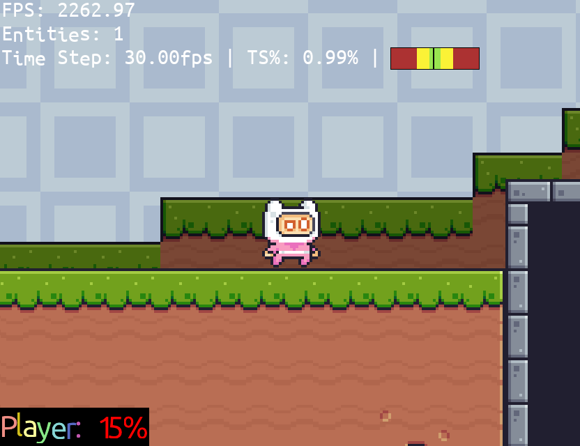

## Debug Utilities

Astro has a few different tools you can enable to make debugging a bit easier. These
options are enabled by creating an .ini file named `Astro.ini` in your project's root
directory with the following keys and header:

    [engine]
    enableTypeChecking=false
    enableDebugOverlay=false
    enableAssetsPrint=false
    disableGamePak=false
    gcBetweenLevels=true

(all of the specified values are the default values if no ini is provided)

For a brief explanation of them,

 + `enableTypeChecking` will force the engine to make sure every Wren value passed to
 foreign methods are the right type of value - use this when developing.
 + `enableDebugOverlay` displays a small overlay on top of the game with basic information
 like entity count, framerate, and information on fixed-timestep if that is enabled. See below image.
 + `enableAssetsPrint` prints the generated `Assets.wren` file to `stdout`.
 + `disableGamePak` stops the engine from loading things from `game.pak` regardless of
 whether or not it finds one.
 + `gcBetweenLevels` tells the engine to call the garbage collector in between each level
 switch. Disabling this can cause strange behaviour.

In reading order, the debug overlay displays

 1. Actual framerate, updated each second.
 2. Entity count in the current level.
 3. How many frames [process_frame](classes/Engine#process_frame) was set to true over the last second.
 4. How much "leeway" the engine is giving to fixed-timestep process frames to compensate for
 fluctuating framerates.
 5. A graphical display of the processed frames' distributions over the last second (black bar in the middle
 is good).

The last 3 will only be displayed if [timestep](classes/Engine#timestep) is not 0.