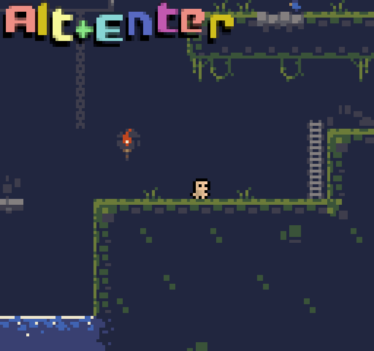
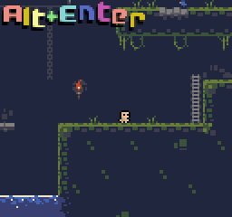
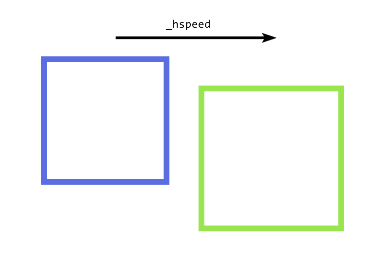
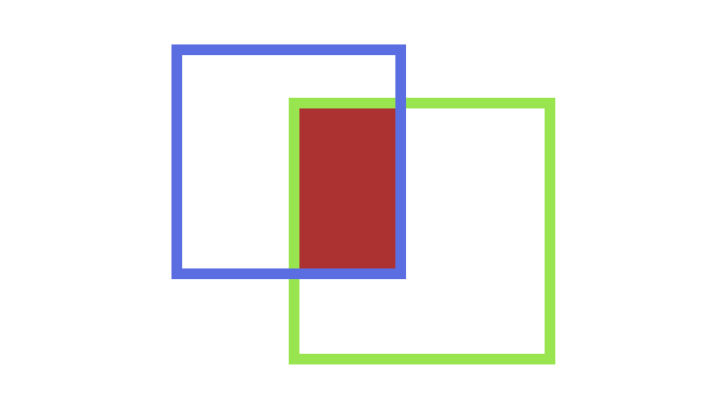
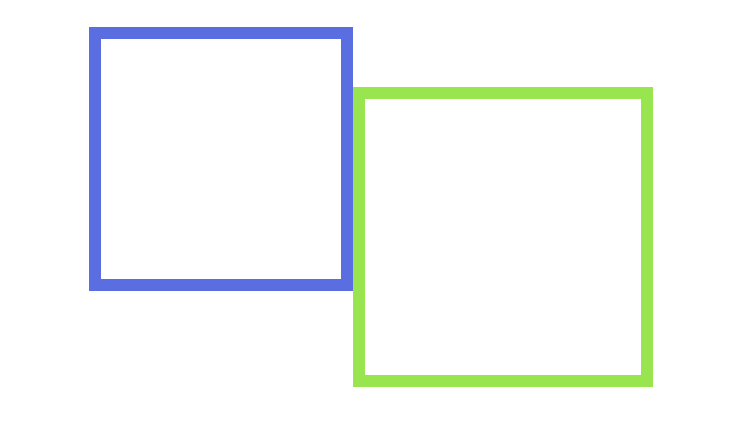
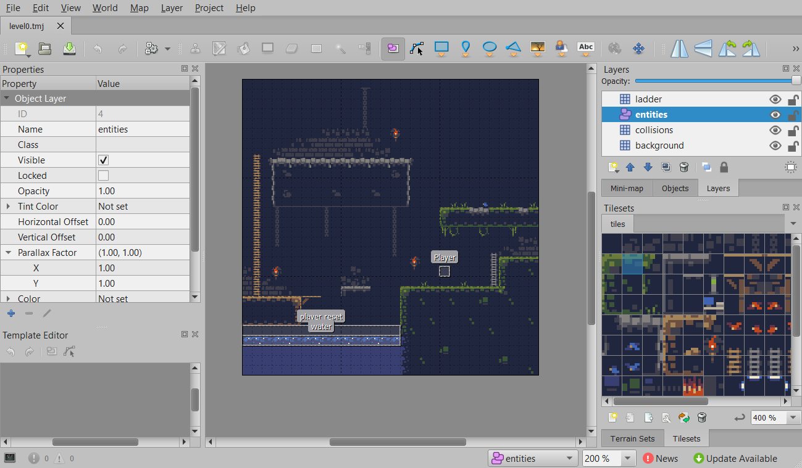

# Simple Game Example Explained
You can find the simple-game example on the 
[Github](https://github.com/PaoloMazzon/Astro/tree/master/examples/simple-game).
Here is a brief explanation of how the small game works. If you're
not yet familiar with the Wren language, check [the section on Wren](Wren)
first.


 + [init.wren](#initwren)
 + [Game.wren](#Gamewren)
 + [Player Entity](#player-entity)
 + [Supporting Entities](#supporting-entities)
 + [Tiled Map](#tiled-map)

## init.wren

```javascript
import "Game" for Game

var renderer_config = {
	"window_title": "Game",
	"window_width": 16 * 8 * 6,
	"window_height": 15 * 8 * 6,
	"fullscreen": false,
	"msaa": Renderer.MSAA_1X,
	"screen_mode": Renderer.SCREEN_MODE_TRIPLE_BUFFER,
	"filter_type": Renderer.FILTER_TYPE_NEAREST
}

var window_icon = "data/logo.png"

System.print(Engine.info)
Engine.fps_limit = 60

var start_level = Game.new()
```

This file is small enough that we can just look at it in whole. There are 3 notable
things we do in this file. First we set the screen width/height `16 * 8 * 6 x 15 * 8 * 6`,
which seems like an odd number, but we'll get there in a second. Second, we set the
window icon to logo found in `data/logo.png`, and third we create the level instance
the game takes place in for the engine.

The game consists of really small 8x8 tiles like the NES, and our screen resolution
reflects this. We are basically saying we want to display `16x15` tiles on screen
up-scaled by a factor of 6 (we do that calculation in `Game.wren`).

The game running at 6x scale



The game running at 2x scale



## Game.wren
The level `Game` is responsible for a few things:

 + Loading the Tiled map and tileset surfaces
 + Creating the cameras for the game
 + Updating the entities
 + Drawing the UI/up-scaling the game

{: .note }
The level also provides a bunch of getter methods for
random pieces of data other entities may need, like the camera or
tilesets. Those won't be covered here.

For the first bit, loading the tiled map, the code in question is

```javascript
var tilesets = load("data/level0.tmj")
_collision_tileset = tilesets["collisions"] // for player collisions
_ladder_tileset = tilesets["ladder"] // so the player can climb ladders
tilset_surfaces = [ // for drawing the whole level more efficiently
    tilesets["background"].draw_to_surface(),
    tilesets["collisions"].draw_to_surface(),
    tilesets["ladder"].draw_to_surface(),
]
```

We store the ladder and collision tileset so the player can use them later, and
then we create a list of each tileset's surface. the [draw_to_surface()](classes/Tileset#draw_to_surface)
method will create a new surface (basically a texture here) with that tileset drawn
to it. This means instead of drawing each tile from each tileset each from, we need
only to draw the surface we drew the whole tileset to. Since we also put it in a list
we can just loop that list, in fact that is what we do later:

```javascript
for (tileset in _tilset_surfaces) {
    Renderer.draw_texture(tileset, 0, 0)
}
```

Using only those two pieces of code we loaded every entity and tileset we need, from the
map and also drew them all efficiently.

{: .note }
You don't need to store the tilesets in a surface, but it is just much more
efficient to do so. This example is so small that it wouldn't cause problems, but
in a map with hundreds or thousands of tiles it would completely hinder performace.

Cameras are less interesting, in this example we create only 2: one for the game world
that the player will control by moving it towards himself, and another that doesn't
move for the UI.

```javascript
_camera = Camera.new()
_ui_camera = Camera.new()
for (cam in [_camera, _ui_camera]) {
    cam.width = game_width
    cam.height = game_height
    cam.update()
}
Renderer.use_cameras_on_surfaces = true

camera.x = player.x - (game_width / 2)
camera.y = player.y - (game_height / 2)
```

Updating the entities is done with the single line `super.update()` and up-scaling
the game isn't terribly important to the game's functionality so it won't be covered
here.

## Player Entity
The player is the most complicated piece of code in the demo, and as such we are
going to look at it more algorithmically. In particular we will look at the animations
and movement code.

Player animations are all pretty straight-forward but buried in the code,
so briefly, we animate the player with 3 different sprites: idle, movement, and jumping.
The jumping sprite is used when the player is not touching the ground, the movement
sprite when the player is actively moving (horizontal speed is not zero), and idle
otherwise. We also make the sprite face left by setting the current sprite's x
scale to -1. This has the unintended effect of mirroring it, so we move the sprite's
origin by its width to account for that. We also keep track of a `_facing` variable
to know at all times if the player should be facing right (+1) or left (-1).

```javascript
if (!colliding(level.tileset, x, y + 1)) {
    sprite = Assets.spr_player_jump
} else if (_hspeed != 0) {
    sprite = Assets.spr_player_walk
} else {
    sprite = Assets.spr_player_idle
}
if (_facing == 1) {
    sprite.scale_x = 1
    sprite.origin_x = 0
} else {
    sprite.scale_x = -1
    sprite.origin_x = 8
}
```

The player may move horizontally and vertically, to represent this we use two
variables: `_hspeed` and `_vspeed`. The player may only control their vertical
and horizontal speed, and not their coordinates directly. This lets us perform
pixel-perfect collisions. We do this by

 1. The player may set their horizontal speed by pressing left/right
 2. If the player is not on a ladder (`!colliding(level.ladder)`)
 3. The player may jump if they are on the ground by pressing up (sets `_vspeed` to -3)
 4. Gravity is applied by adding some small value to `_vspeed`
 5. If the player is on a ladder
 6. The player may simply control their vertical speed with the up and down keys
 7. Gravity is not applied
 8. Handle collisions and move the player

Parts 1-3 are covered here:

```javascript
var speed = 1.2
var gravity = 0.18
var jump_speed = 3
var ladder_speed = 1
var touching_ladder = colliding(level.ladder_tileset)

// Part 1
_hspeed = Keyboard.keys_as_axis(Keyboard.KEY_LEFT, Keyboard.KEY_RIGHT) * speed

if (!touching_ladder) {
    // Part 3
    if (Keyboard.key_pressed(Keyboard.KEY_UP) && level.tileset.collision(hitbox, x, y + 1)) {
        _vspeed = -jump_speed
    }
    _vspeed = _vspeed + gravity
} else {
    // Part 5
    _vspeed = Keyboard.keys_as_axis(Keyboard.KEY_UP, Keyboard.KEY_DOWN) * ladder_speed
}
```

Collisions are handled pre-emptively - we want to detect when one is about to happen and
not just have the player clip into every random block. 

For a brief visualization of our entity and its horizontal speed.



If we simply added the horizontal speed to our position, we would be inside the block.



But we want to be right next to the block and not inside it.



We accomplish this in 3 steps:

 1. Check if there will be a collision if we add `_hspeed` to our position.
 2. If so, snap to the nearest wall in that direction.
 3. If not, add `_hspeed` to our x coordinate.
 
And that process is repeated for the y axis and `_vspeed`. In code,

```javascript
if (colliding(level.tileset, x + _hspeed, y)) {
    x = _hspeed > 0 ? level.tileset.snap_right(hitbox, x, y) : level.tileset.snap_left(hitbox, x, y)
    _hspeed = 0
}
x = Math.clamp(x + _hspeed, 0, level.tileset.width - 8)

if (colliding(level.tileset, x, y + _vspeed)) {
    y = _vspeed > 0 ? level.tileset.snap_down(hitbox, x, y) : level.tileset.snap_up(hitbox, x, y)
    _vspeed = 0
}
y = Math.clamp(y + _vspeed, 0, level.tileset.height - 8)
```

(We also clamp the x/y values so the player stays inside the level)

You may notice we use methods like [snap_*](classes/Tileset#snap_right), as these methods
will take our entity's hitbox and move that hitbox as close to the nearest wall as possible.

And that is the entirety of what the player class is responsible.

## Supporting Entities
The example game has two other supporting entities, one that detects if the player
has fallen into water (`ResetPlayer`), and another that animates the water (`Water`). 
They are both found in `Entities.wren`.

`ResetPlayer` works by using the entity method [colliding()](classes/Entity#colliding)
to detect if the player has touched it, and if so, sets the player's x/y coordinates to
where it was at the start. It automatically has a hitbox assigned to it by [load()](./classes/Level#load)
because we specify a width and height for it in the Tiled map.

```javascript
update(level) {
    if (colliding(level.player)) {
        level.player.x = 160
        level.player.y = 152
    }
}
```

`Water` is a bit hacky and unimportant, but briefly it increments a counter every 0.5
seconds and uses that counter to draw different water tiles from the tileset. More importantly
it directly access the Tiled map data so we can see that in action:

```javascript
create(level, tiled_data) {
    super.create(level, tiled_data)
    _tiles_across = tiled_data["width"] / 8
    _timer = 0
    _frame = 0
}
``` 

Tiles in our game are 8 pixels wide, so we can calculate how many we need to cover in water
tiles by taking the width of our `Water` entity and dividing it by 8.

## Tiled Map
To bring this project together we need a nice little level to load from - we'll build
it in Tiled.



In the map we can see that there are 3 tile layers: collisions, ladder, and background.
There is also an entity layer where our entities are located. If you recall from the
[Game.wren](#gamewren) section, we pull those tilesets by their names in this map.