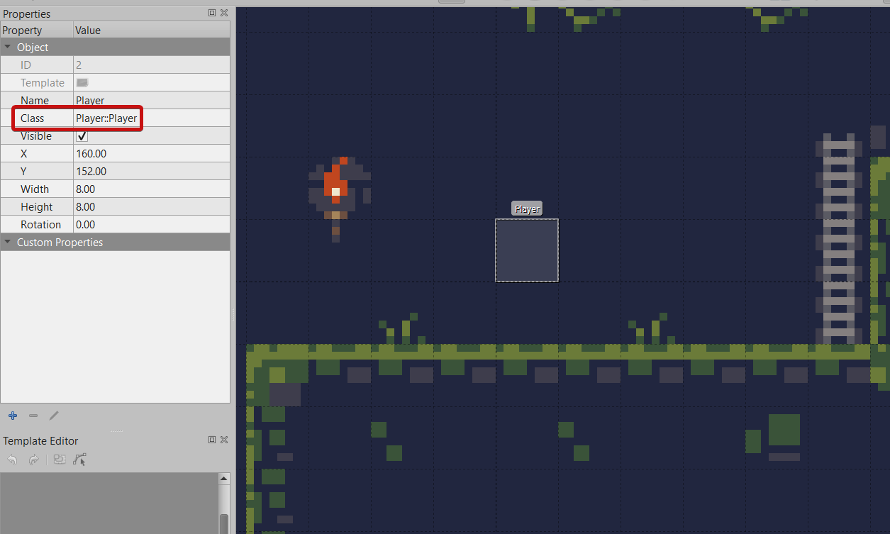
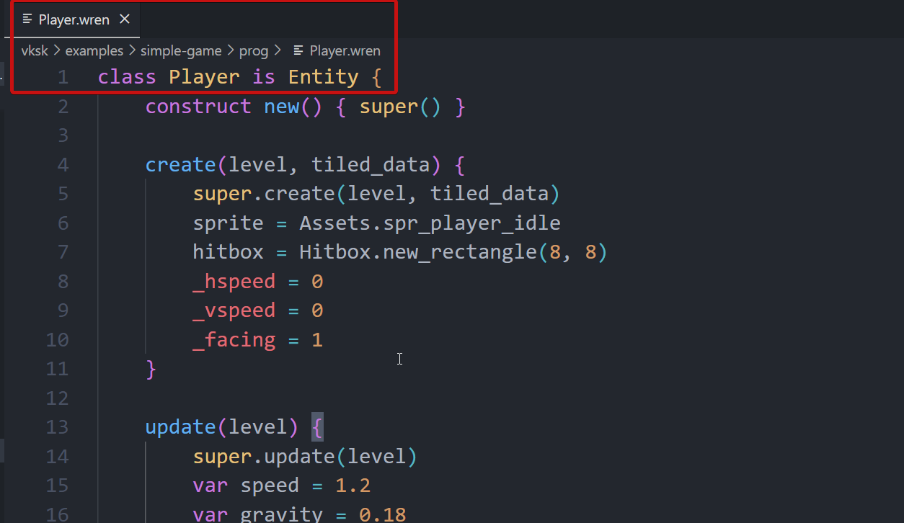

# Tiled Integration
Astro supports the use of [Tiled](https://www.mapeditor.org/) as a level editor. With the
use of [load()](./classes/Level#load) we can load a Tiled map and create all the necessary
entities and tilesets in it automatically.

## Overview
In short you load Tiled maps by calling [load()](./classes/Level#load) in your level's `create`
method with the desired map filename. 

[load()](./classes/Level#load) will:

 - Make copies of each tile layer as a new [Tileset](./classes/Tileset) in the returned map
 - Create entities from each entity layer by looking up their `class` field (See [get_class()](classes/Engine#get_class) for formatting information).
 - Automatically set each entity's starting x/y position as well as a hitbox if width and height were specified
 - Pass a map of all other tiled data to each entity when its created

In the above example, the class field in Tiled is set to `Player::Player`, meaning the class `Player` inside
the module `Player`. For clarity's sake, `Entities::Water` would mean the class `Water` inside the module
`Entities`. All the other fields above and below class are passed to entities when they are created. See
[create()](classes/Entity#create).

## How To Use Tiled
There are some things you need to do on Tiled's side so that Astro knows how to load the map
properly.
 
 1. All maps must be saved in JSON format, see below image.
 2. Tilesets must be embedded (it pulls the images from the asset compiler, there are no duplicate image
 loads).
 3. Object's class file must be the entity's class name in the format `file::class`, for example if
 wanted to specify the `Player` class in the file `Game/Player.wren` we would use `Game/Player::Player`
 for the class field.
 4. Object templates are not currently supported, you must detach all object templates before using it in-engine.
 

