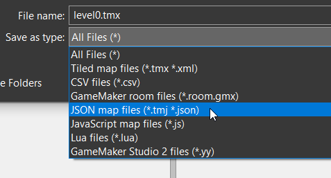

# Tiled Integration
Astro supports the use of [Tiled](https://www.mapeditor.org/) as a level editor. With the
use of [load](./classes/Level.md#load) we can load a Tiled map and create all the necessary
entities and tilesets in it automatically.

## Overview
In short you load Tiled maps by calling [load](./classes/Level.md#load) in your level's `create`
method with the desired map filename. [load](./classes/Level.md#load) returns a map of every
tile layer in the map as a `lib/Util::Tileset`, with which you may do as you like. The load method
automatically creates all objects in the map, as well as automatically sets their x/y position and
provides them with a map containing all the extra data they had in Tiled.

## How To Use Tiled
There are some things you need to do on Tiled's side so that Astro knows how to load the map
properly.
 
 1. All maps must be saved in JSON format, see below image.
 2. Tilesets must be embedded (it pulls the images from the asset compiler, there are no duplicate image
 loads).
 3. Object's class file must be the entity's class name in the format `file::class`, for example if
 wanted to specify the `Player` class in the file `Game/Player.wren` we would use `Game/Player::Player`
 for the class field.
 4. Map file must be in `assets/` folder.
 5. All tilesets used must be loaded as textures by the asset compiler. You may only have one size
 of cell width/height per map.
 

Feel free to check the demo to see all this in action.

-----------

[Getting Started](GettingStarted.md) | [API Reference](API.md)