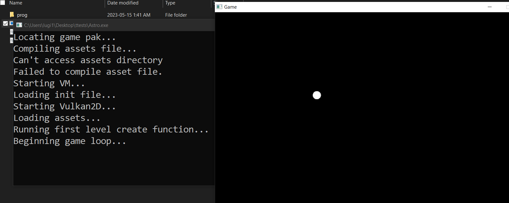

# Brief Wren Overview
Astro uses Wren as its runtime scripting language for its simple syntax
and great performance. For a detailed overview of the language in its
entirety, start with the [Wren documentation](https://wren.io/syntax.html).
Additionally, it is ***strongly encouraged*** for you to [try Wren](https://wren.io/try/)
in your browser as you follow this. Additionally, this is just a quick
little overview and not a full substitue for a Wren tutorial. It is intended
to be only enough to get you started in Astro.

 + [Syntax](#Syntax)
 + [Modules](#modules)
 + [Classes](#Classes)
 + [Using Wren in Astro](#using-wren-in-astro)

## Syntax
Wren is somewhere between C++ and JavaScript in terms of syntax, if you're familiar
with either this will all feel very normal. Wren is dynamically typed and
garbage-collected, meaning Wren will guess what type your variable is depending
on what value you give it, and you don't need to manage your own memory. The garbage
collection in particular can be very handy in Astro, because you may freely allocate
resources like fonts or models without ever having to worry about the memory involved.

```javascript
// ------------------------- Types ------------------------- //
var my_number = 5 // All numbers are 8-byte floats in Wren
var my_string = "hello" // c-style string
var my_list = [5, "string", [1, 2, 3]] // list
var my_map = {"key": 5, 1: "the"} // maps of key/val pairs
var nothing = null // null value, Astro will often return this on failure
var my_class = Surface.new(100, 100) // an instance of the class "Surface"
var added = my_number.toString + my_string // many built-in types have a .toString method
System.print("thing") // print to stdout

// ---------------------- Control Flow ---------------------- //
if (condition) {
    // basic if statement
} else if (condition && !condition || condition) {
    // You may use &&, ||, and ! for "and", "or", and "not"
    // It is short-circuiting
} else {
    // else branch
}

while (variable is String) {
    // While-loop
    break // stops loop
}

for (i in 0..3) {
    // For-loop, you can loop over the contents of a list,
    // a range like 0..3 (inclusive), or an iterator (not covered here)
    continue // jump to next iteration
}
```

## Modules
Wren source files are modules, and they have special scoping rules and specific ways
to import them. Variables defined outside of a class in a module are module variables,
including classes themselves. We can use this to import specific classes or module-level
variables into other modules. Unless you make your whole game in the `init.wren` file
you would probably have something like

```javascript
import "Levels/Menu" for MenuLevel, some_variable
```

at the top of your `init.wren` file. This snippet of code looks for the module `Levels/Menu`,
and if it finds it will attempt to provide a reference to the variable `MenuLevel` and
`some_variable` to our file. 

{: .note }
Although the import says `"Levels/Menu"`, the actual file Astro will look for will be
`prog/Levels/Menu.wren`. Astro will automatically start searching for Wren modules
in the `prog` directory and append the .wren extension to locate the proper module.

Astro automatically imports all relevant engine files into each file in your project so you
will only ever need to import your own project files.

## Classes
Wren classes have a couple small quirks that may take a second to get used to. In particular,

 1. There are no default constructors
 2. Class-level variables are called fields and must begin with an underscore; ie
 `_time_left = 30`
 3. Fields are all private, you must define getters and setters
 4. You may overload operators and methods by arity (multiple methods may have the same name
 as long as each one has a different argument count)

For example,

```javascript
class Vec2D {
    x { _x }
    y { _y }
    x=(val) { _x = val }
    y=(val) { _y = val }
    magnitude { (_x.pow(2) + _y.pow(2)).sqrt }
    toString { magnitude.toString }
  
    construct new(x, y) {
        _x = x
        _y = y
    }
    construct copy(vec2) {
        _x = vec2.x
        _y = vec2.y
    }
    
    +(other) {
        if (!(other is Vec2D)) {
            return Vec2D.copy(this)
        }
        return Vec2D.new(_x + other.x, _y + other.y)
    }
}

var vec1 = Vec2D.new(2, 2)
var vec2 = Vec2D.new(-2, 1)
var num = 10
System.print(vec1 + vec2)
System.print(vec1 + 10)
```

Running that program in the [online Wren interpreter](https://wren.io/try/) will print

    3
    2.8284271247462

(Because `System.print` will run `toString` on any objects it gets)

## Using Wren in Astro
Feel free to check the examples in [the Github](https://github.com/PaoloMazzon/Astro/tree/master/examples)
for long, detailed demonstrations. Typically using Wren in Astro consists of making child classes and instances
of entities and levels and calling static methods from other Astro classes.

```javascript    
class Game is Level {
    construct new() { }
    
    create() {
        _x = 100
        _y = 100
    }
    
    pre_frame() { }

    update() {
        var speed = Engine.delta * 100
        _x = _x + Keyboard.keys_as_axis(Keyboard.KEY_A, Keyboard.KEY_D) * speed
        _y = _y + Keyboard.keys_as_axis(Keyboard.KEY_W, Keyboard.KEY_S) * speed

        Renderer.draw_circle(_x, _y, 10)
    }

    destroy() { }
}

var renderer_config = {
    "window_title": "Game",
    "window_width": 800,
    "window_height": 600,
    "fullscreen": false,
    "msaa": Renderer.MSAA_8X,
    "screen_mode": Renderer.SCREEN_MODE_TRIPLE_BUFFER,
    "filter_type": Renderer.FILTER_TYPE_NEAREST
}

var start_level = Game.new()
```

For a really simple intro to Astro, [download](https://github.com/PaoloMazzon/Astro/releases)
the latest Astro release and copy the above code to a file named `prog/init.wren`.

 