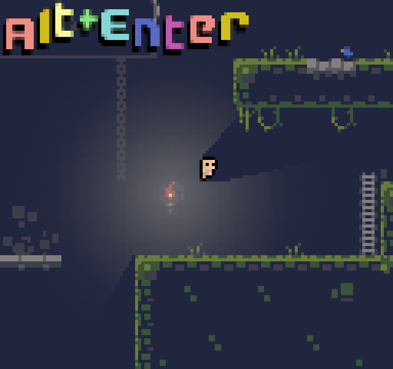

## Lighting
Astro provides some simple hardware-accelerated light and shadow support to 
render lighting effects in 2D. One general warning to keep in mind for these features
is that these are global and not tied to any specific level. This means that is
generally good practice to add all the shadows/lights at the start of a level
and reset it at the end to refrain from dangling pointers (which can easily happen
with these methods). See the demo in [Github](https://github.com/PaoloMazzon/Astro/tree/master/examples/simple-game)
for a complete example of how to properly use this feature. 

+ [add_shadow()](#add_shadow)
+ [add_light()](#add_light)
+ [reset()](#reset)
+ [flush_vbo()](#flush_vbo)

For a general overview of decent practices,

# At the start of a level
Create all of your lights and shadows with [add_light()](#add_light) and [add_shadow()](#add_shadow). You can
add lights later at relatively low cost in terms of performance but make sure you add all your shadows at once
because you need to [flush_vbo()](#flush_vbo) to see the changes to shadows and that method is expensive.

# Throughout the level
Add/remove lights as needed, disable and move shadow objects around as desired.

# At the end of the level
Call [reset()](#reset) and make sure none of the light/shadow variables linger to the next level to ensure
minimal dangling pointers.

## add_shadow()
`static add_shadow(edges)`

Parameters
 + `edges -> List` A list of edges for the shadow object, in the form `[[x1, y1, x2, y2], [x1, y1, x2, y2], ...]`

Adds a shadow object to the lighting system and returns it. See [Shadow](#Shadow) for more information.

## add_light()
`static add_light(x, y, rotation, origin_x, origin_y, texture)`

## reset()
`static reset()`

Deletes all shadow objects, lights and VBOs that are currently loaded in the lighting system.
You will likely want to do this between level/loading unloading scenes. 

{: .note }
This will invalidate all variables previously acquired from [add_shadow()](#add_shadow) and
[add_light()](#add_light) causing dangling pointers for any of those variables you still have
in scope. For this reason you should generally want to keep the values returned by [add_light()](#add_light)
and [add_shadow()](#add_shadow) local to the level scope and just reset at the end of each level.

## flush_vbo()
`static flush_vbo()`

Once you are done adding your shadow objects you must call this method to push the shadow
objects to the GPU before you may draw them.