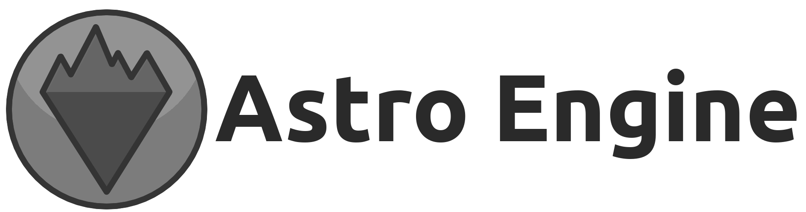

Astro Engine is a game development framework that provides all the things you need to
easily develop games. It uses the scripting language [Wren](https://github.com/wren-lang/wren)
for game logic, taking full advantage of the features that come with an embedded
scripting language.

Features
========

 + Intuitive API that utilizes [Wren](https://github.com/wren-lang/wren) as its language
 + Manual and automatic resource management
 + Fast and very flexible cameras
 + Simple level and entity management
 + Complete [API documentation](https://astroengine.ca/classes/)
 + Load [Tiled](https://www.mapeditor.org/) maps automatically

Getting Started
===============
See [Getting Started](https://astroengine.ca/GettingStarted.html) for a detailed breakdown, and check out the
[API Reference](https://astroengine.ca/classes/) for everything else. In short, you need a Wren file the engine
will use as an entry point and at least one level.
    
    class Game is Level {
        construct new() { }
        
        create() {
            _x = 100
            _y = 100
        }
        
        pre_frame() { }
    
        update() {
            var speed = Engine.delta * 100
            _x = _x + Keyboard.keys_as_axis(Keyboard.KEY_A, Keyboard.KEY_D) * speed
            _y = _y + Keyboard.keys_as_axis(Keyboard.KEY_W, Keyboard.KEY_S) * speed
    
            Renderer.draw_sprite(Assets.spr_sprite, _x, _y)
            Renderer.draw_font(Assets.fnt_font, "The quick brown fox jumps over the lazy dog.", 0, 0)
        }
    
        destroy() { }
    }